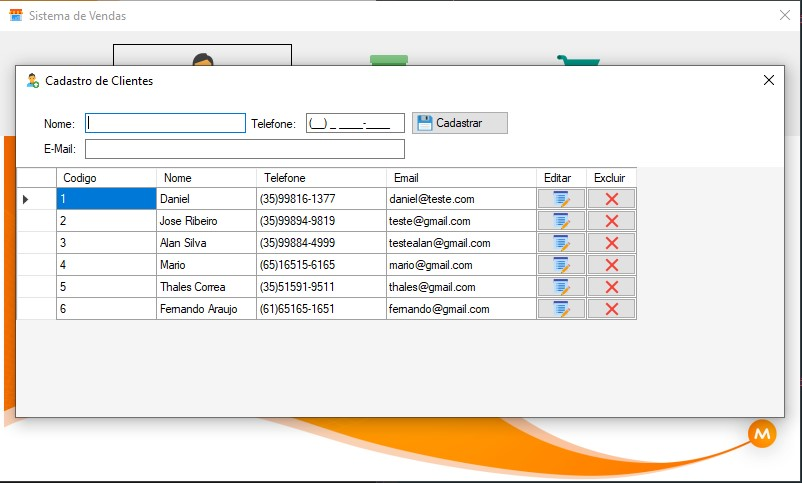

<h1 align="center">
 <br>
 Sistema de Vendas básico em C# .NET </h1>

<p align="center">
 <a href="https://www.linkedin.com/in/daniellimals/">
    
  </a>
  <a href="https://github.com/DanieldeLimaS/SisVendas.Dotnet.CRUD/blob/master/LICENSE">
    
  </a>
  <a href="https://github.com/DanieldeLimaS/SisVendas.Dotnet.CRUD/issues">
    
  </a>
  <a href="https://github.com/DanieldeLimaS/SisVendas.Dotnet.CRUD/issues?q=is%3Aissue+is%3Aclosed">
    
  </a>
  <a href="https://github.com/DanieldeLimaS/SisVendas.Dotnet.CRUD/stargazers">
    
  </a>
  <a href="https://github.com/DanieldeLimaS/SisVendas.Dotnet.CRUD/network">
    
  </a>
</p>


<p align="center">  
  
  
  
  
  
</p>

## :page_facing_up: Descrição

Sistema Básico de vendas, com as principais operações de CRUD, o projeto foi criado em Windows forms na versão .NET Framework 4.8 utilizando a linguagem C# do Dotnet

### ✨Pré-requisitos para a Criação do banco de dados: ✨

foi usado o banco de dados criado na propria solução do projeto, o arquivo será criado atraves do Migration, executar os seguintes comandos no Console de Gerenciador de Pacotes do Visual studio para a criação:
```
 Enable-Migrations

 Add-Migration inicial

 Update-database

```
 ## 🎲 Diagrama do banco de dados 🎲


--- 
### 🚀 Todo o tempo dedicado ao projeto foi igual a uma carga de 8h30 horas.🚀


## Tecnologias

Esse projeto foi desenvolvido com as seguintes tecnologias:

- [.NET Framework 4.8](https://dotnet.microsoft.com/download/dotnet-framework/net48)
- [Entity Framework 6](https://docs.microsoft.com/pt-br/ef/ef6/fundamentals/install)
- [SQL SERVER](https://www.microsoft.com/pt-br/sql-server/sql-server-downloads)
- [IDE Visual Studio](https://visualstudio.microsoft.com/pt-br/)
- Para mais detalhes, veja o arquivo<kbd>[CRUD.csproj](./SisVendas.Dotnet.CRUD/UI.csproj.csproj)</kbd>

---


## :closed_book: Licença

This project is [MIT](https://github.com/Igor-Gregori/moveit/blob/main/LICENSE) licensed.
